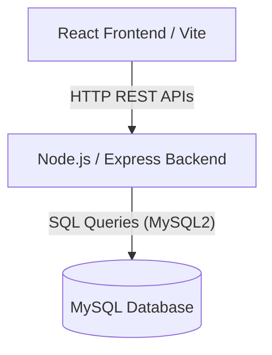

# Architecture Overview

## Technology Stack

### Frontend (Client-Side)
- **Framework**: React 18
- **Build Tool**: Vite
- **Language**: TypeScript
- **Styling**: Tailwind CSS
- **Component Library**: Shadcn UI (Radix UI primitives)
- **Icons**: Lucide React
- **Animations**: Framer Motion
- **Data Visualization**: Recharts
- **Routing**: React Router DOM
- **Notifications**: Sonner (Toast system)

### Backend (Server-Side)
- **Runtime**: Node.js
- **Framework**: Express.js
- **Middleware**: CORS, Express JSON parser
- **Database Connectivity**: MySQL2 module (Connection Pooling)
- **Architecture Pattern**: MVC (Model-View-Controller) abstraction via Express Routers

### Database
- **System**: MySQL 8.x
- **Schema Design**: Highly relational, utilizing Foreign Keys to ensure data integrity and prevent orphan records.

## High-Level Architecture

### Authentication Flow
1. **Client**: Sends credentials (email, password) to `/api/login`.
2. **Server**: Validates credentials against the `users` table.
3. **Client**: Maintains session context using React Context API (`AuthContext`), storing the active user profile and role. (Note: JWT implementation was deferred as per project requirements, using role-based contextual routing for the current iteration).
4. **Client-Side Authorization**: Protected routes (`ProtectedRoute` component) check the active user role against the required role for specific pages (e.g., `/admin`, `/guide-dashboard`).

### Data Fetching
- The frontend uses centralized data fetching hooks (`src/lib/hooks.ts`) mapped to backend endpoints using an Axios interceptor (`src/lib/api.ts`).
- React's `useEffect` handles data fetching on component mount, coupled with `loading` state variables and Skeleton UI fallbacks to ensure a smooth user experience.

### Error Handling & Notifications
- Backend errors (HTTP 4xx/5xx) are caught by the Axios interceptor and propagated to the UI.
- The UI surfaces these errors using `sonner` toast notifications.
- System-generated notifications (e.g., Weekly Log approved) are inserted into the `notifications` table by the backend and polled/fetched by the frontend `useNotifications` hook.
